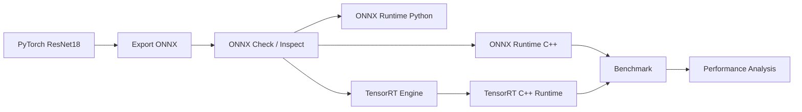

# 基于 ONNX Runtime 与 TensorRT 的视觉模型端侧推理部署与性能优化

> 一个面向端侧 AI / 边缘 AI / 视觉模型部署岗位的推理部署工程项目。项目覆盖 PyTorch → ONNX → ONNX Runtime → TensorRT 的完整部署链路，并对不同后端的延迟、吞吐量和分阶段耗时进行 benchmark 对比。

## 项目概述

本项目以 `ResNet18` 图像分类模型为示例，完成从模型导出、正确性验证、Python/C++ 推理、TensorRT engine 构建，到 C++ benchmark 性能对比的完整流程。

项目重点不在模型训练，而在端侧部署工程能力：

- 将 PyTorch 模型导出为支持动态 batch 的 ONNX 模型；
- 使用 ONNX Runtime 验证 ONNX 模型输出正确性；
- 实现 ONNX Runtime Python / C++ 推理流程；
- 使用 TensorRT 构建 FP32 / FP16 engine；
- 实现 TensorRT C++ Runtime 推理；
- 构建 benchmark 测试流程，统计平均延迟、P95 延迟、FPS 和分阶段耗时；
- 对比 ORT CPU、TensorRT FP32、TensorRT FP16 的性能差异；
- 分析端到端部署链路中的性能瓶颈。

## 技术栈

| 类别 | 技术 |
|---|---|
| 模型框架 | PyTorch / torchvision |
| 中间表示 | ONNX |
| 推理后端 | ONNX Runtime / TensorRT |
| C++ 图像处理 | OpenCV |
| GPU 加速 | CUDA / TensorRT |
| 工程构建 | CMake / C++17 |
| 性能评估 | latency / P95 latency / FPS / warmup / repeat |
| 结果分析 | CSV / matplotlib |

## 项目亮点

- 支持 PyTorch → ONNX 模型导出，并配置动态 batch。
- 实现 PyTorch 与 ONNX Runtime 的输出一致性验证。
- 实现 Python ONNX Runtime 单图 / 批量推理与 benchmark。
- 实现 ONNX Runtime C++ 推理与 benchmark。
- 实现 Python ORT 与 C++ ORT 输出一致性验证。
- 使用 `trtexec` 构建 TensorRT FP32 / FP16 engine。
- 实现 TensorRT C++ Runtime 推理和 benchmark。
- 统计平均延迟、P95 延迟、最小/最大延迟、FPS。
- 拆分统计 preprocess / inference / postprocess 三阶段耗时。
- 形成 ORT CPU 与 TensorRT FP32/FP16 的性能对比表。

## 项目结构

```text
edge_ai_deploy_project/
├── README.md
├── requirements.txt
├── config/
│   └── config.yaml
├── scripts/
│   ├── export_model.py              # PyTorch -> ONNX
│   ├── check_onnx.py                # ONNX 模型检查
│   ├── inspect_onnx.py              # 打印 ONNX 输入输出信息
│   ├── verify_python_onnx.py        # PyTorch / ONNX Runtime 一致性验证
│   ├── verify_python_cpp_ort.py     # Python ORT / C++ ORT 一致性验证
│   ├── benchmark_test.py            # Python ORT benchmark
│   ├── plot_benchmark.py            # benchmark 可视化
│   └── ...
├── cpp/
│   ├── CMakeLists.txt
│   ├── include/
│   │   ├── ort_runner.h
│   │   ├── trt_runner.h
│   │   ├── image_process.h
│   │   ├── benchmark.h
│   │   └── ...
│   └── src/
│       ├── main.cpp                 # ONNX Runtime C++ 推理入口
│       ├── benchmark_main.cpp       # ONNX Runtime C++ benchmark
│       ├── verify_cpp_ort.cpp       # C++ ORT 输出保存与验证
│       ├── trt_infer_main.cpp       # TensorRT C++ 推理入口
│       ├── trt_benchmark_main.cpp   # TensorRT C++ benchmark
│       ├── ort_runner.cpp
│       ├── trt_runner.cpp
│       └── ...
├── labels/
│   └── imagenet_classes.txt
├── models/
│   ├── README.md
│   └── .gitkeep
├── data/
│   ├── README.md
│   └── .gitkeep
├── tensorrt/
│   └── logs/                        # TensorRT 构建与运行日志
└── results/
    ├── benchmark/
    │   ├── ort_cpu_benchmark.csv
    │   └── trt_benchmark_summary.csv
    ├── verify/
    │   ├── verify_pytorch_onnx.json
    │   └── verify_python_cpp_ort.json
    └── plots/
        ├── benchmark_avg_infer_ms.png
        └── benchmark_throughput.png
```

## 部署链路



## 环境依赖

### Python 环境

建议使用 conda：

```bash
conda create -n edge_ai python=3.10
conda activate edge_ai
pip install -r requirements.txt
```

主要 Python 依赖包括：

- torch
- torchvision
- onnx
- onnxruntime
- opencv-python
- numpy
- pandas
- matplotlib
- PyYAML

### C++ 环境

C++ 部分依赖：

- CMake >= 3.22
- C++17
- OpenCV
- ONNX Runtime C++ Runtime
- CUDA Toolkit
- TensorRT

> 注意：需要根据本机环境修改 `cpp/CMakeLists.txt` 中 ONNX Runtime、TensorRT、CUDA 的实际路径。

## 数据与模型准备

本仓库默认不提交大规模图片、ONNX 模型和 TensorRT engine 文件。

测试图片建议放置为：

```text
data/
└── images/
    ├── image1.jpg
    ├── image2.jpg
    └── ...
```

模型文件建议放置为：

```text
models/
├── model.onnx
├── model_fp32.engine
└── model_fp16.engine
```

TensorRT engine 与 GPU、CUDA、TensorRT 版本强相关，建议在本机重新构建，不建议直接复用他人 engine 文件。

## 1. PyTorch 导出 ONNX

运行：

```bash
python scripts/export_model.py
```

导出逻辑：

- 使用 `torchvision.models.resnet18(weights=ResNet18_Weights.DEFAULT)`；
- 输入 shape 为 `[batch, 3, 224, 224]`；
- 支持动态 batch；
- 输出 ONNX 模型。

检查 ONNX：

```bash
python scripts/check_onnx.py
python scripts/inspect_onnx.py
```

## 2. PyTorch / ONNX Runtime 一致性验证

运行：

```bash
python scripts/verify_python_onnx.py \
  --onnx models/model.onnx \
  --image data/images/test.jpg \
  --output results/verify/verify_pytorch_onnx.json \
  --device cpu \
  --provider CPUExecutionProvider
```

验证内容：

- PyTorch 输出；
- ONNX Runtime 输出；
- max absolute error；
- mean absolute error；
- Top1 是否一致；
- Top5 是否一致。

结果示例：

```text
results/verify/verify_pytorch_onnx.json
```

## 3. ONNX Runtime Python 推理与 benchmark

CPU benchmark：

```bash
python scripts/benchmark_test.py \
  --input data/images \
  --output results/python_benchmark_cpu \
  --models models \
  --config config \
  --batch_size 1 8 16 32 \
  --warmup 5 \
  --repeat 50 \
  --provider CPUExecutionProvider
```

如果当前环境支持 `CUDAExecutionProvider`，也可以运行 GPU benchmark：

```bash
python scripts/benchmark_test.py \
  --input data/images \
  --output results/python_benchmark_gpu \
  --models models \
  --config config \
  --batch_size 1 8 16 32 \
  --warmup 5 \
  --repeat 50 \
  --provider CUDAExecutionProvider
```

## 4. 编译 C++ 工程

```bash
cd cpp
rm -rf build
mkdir build
cd build
cmake ..
make -j$(nproc)
```

编译成功后生成：

```text
cpp_ort_infer
cpp_ort_benchmark
verify_cpp_ort
cpp_trt_infer
cpp_trt_benchmark
```

## 5. ONNX Runtime C++ 推理

```bash
cd cpp/build

./cpp_ort_infer \
  ../../models/model.onnx \
  ../../data/images \
  ../../labels/imagenet_classes.txt \
  8
```

参数说明：

| 参数 | 含义 |
|---|---|
| `../../models/model.onnx` | ONNX 模型路径 |
| `../../data/images` | 输入图片目录 |
| `../../labels/imagenet_classes.txt` | ImageNet 标签文件 |
| `8` | batch size |

## 6. ONNX Runtime C++ benchmark

```bash
cd cpp/build

./cpp_ort_benchmark \
  ../../models/model.onnx \
  ../../data/images \
  ../../labels/imagenet_classes.txt \
  32 \
  5 \
  50 \
  ../../results/benchmark/ort_cpu_benchmark.csv
```

统计字段包括：

- average latency
- P95 latency
- min / max latency
- FPS
- average preprocess time
- average inference time
- average postprocess time

## 7. TensorRT engine 构建

### FP32 engine

```bash
trtexec \
  --onnx=models/model.onnx \
  --saveEngine=models/model_fp32.engine \
  --minShapes=input:1x3x224x224 \
  --optShapes=input:8x3x224x224 \
  --maxShapes=input:32x3x224x224
```

### FP16 engine

```bash
trtexec \
  --onnx=models/model.onnx \
  --saveEngine=models/model_fp16.engine \
  --fp16 \
  --minShapes=input:1x3x224x224 \
  --optShapes=input:8x3x224x224 \
  --maxShapes=input:32x3x224x224
```

参数说明：

| 参数 | 含义 |
|---|---|
| `--onnx` | 输入 ONNX 模型 |
| `--saveEngine` | 输出 TensorRT engine |
| `--fp16` | 启用 FP16 精度 |
| `--minShapes` | 动态输入最小 shape |
| `--optShapes` | TensorRT 优化时重点优化的 shape |
| `--maxShapes` | 动态输入最大 shape |

本项目保留了 TensorRT 构建日志：

```text
tensorrt/logs/build_fp32.log
tensorrt/logs/build_fp16.log
```

## 8. TensorRT C++ 推理

FP16：

```bash
cd cpp/build

./cpp_trt_infer \
  ../../models/model_fp16.engine \
  ../../data/images \
  ../../labels/imagenet_classes.txt \
  8
```

FP32：

```bash
./cpp_trt_infer \
  ../../models/model_fp32.engine \
  ../../data/images \
  ../../labels/imagenet_classes.txt \
  8
```

TensorRT C++ Runtime 推理流程：

```text
加载 TensorRT engine
↓
创建 runtime / engine / execution context
↓
OpenCV 图像预处理
↓
Host 输入拷贝到 Device
↓
TensorRT enqueue 推理
↓
Device 输出拷贝回 Host
↓
TopK 后处理
```

## 9. TensorRT C++ benchmark

FP16：

```bash
cd cpp/build

./cpp_trt_benchmark \
  ../../models/model_fp16.engine \
  ../../data/images \
  ../../labels/imagenet_classes.txt \
  32 \
  5 \
  50 \
  TensorRT_FP16 \
  ../../results/benchmark/trt_benchmark_summary.csv
```

FP32：

```bash
./cpp_trt_benchmark \
  ../../models/model_fp32.engine \
  ../../data/images \
  ../../labels/imagenet_classes.txt \
  32 \
  5 \
  50 \
  TensorRT_FP32 \
  ../../results/benchmark/trt_benchmark_summary.csv
```

## Benchmark 设置

| 项目 | 设置 |
|---|---|
| 模型 | ResNet18 |
| 输入尺寸 | `3 × 224 × 224` |
| 测试图片数量 | 约 244 张 |
| warmup | 5 |
| repeat | 50 |
| batch size | 1 / 8 / 12 / 16 / 32 |
| 对比后端 | ORT_CPU / TensorRT_FP32 / TensorRT_FP16 |

## Benchmark 结果

### 最优结果对比

| Backend | Batch Size | Avg Latency (ms/batch) | P95 Latency (ms) | FPS (images/s) | Avg Infer (ms/batch) |
|---|---:|---:|---:|---:|---:|
| ORT_CPU | 32 | 975.40 | 1085.24 | 31.27 | 905.44 |
| TensorRT_FP32 | 32 | 98.00 | 128.23 | 311.23 | 26.85 |
| TensorRT_FP16 | 32 | 96.31 | 135.91 | 316.69 | 26.19 |

在 batch size = 32 条件下，TensorRT FP16 相比 ORT CPU：

- FPS 从 31.27 images/s 提升到 316.69 images/s，约提升 **10.13×**；
- 端到端平均延迟从 975.40 ms/batch 降低到 96.31 ms/batch，约下降 **90.13%**；
- 推理阶段耗时从 905.44 ms/batch 降低到 26.19 ms/batch，约下降 **34.58×**。

### 不同 batch size 下吞吐量对比

| Batch Size | ORT_CPU FPS | TensorRT_FP16 FPS | Speedup |
|---:|---:|---:|---:|
| 1 | 30.81 | 214.77 | 6.97× |
| 8 | 29.85 | 283.42 | 9.50× |
| 12 | 29.81 | 282.50 | 9.48× |
| 16 | 30.49 | 297.48 | 9.76× |
| 32 | 31.27 | 316.69 | 10.13× |

### 分阶段耗时分析

ORT CPU，batch size = 32：

| Stage | Time (ms/batch) | Proportion |
|---|---:|---:|
| Preprocess | 69.16 | 7.09% |
| Inference | 905.44 | 92.83% |
| Postprocess | 0.80 | 0.08% |

TensorRT FP16，batch size = 32：

| Stage | Time (ms/batch) | Proportion |
|---|---:|---:|
| Preprocess | 69.29 | 71.95% |
| Inference | 26.19 | 27.19% |
| Postprocess | 0.83 | 0.86% |

结论：

- 在 ORT CPU 后端下，主要瓶颈集中在模型推理阶段；
- 使用 TensorRT 后，模型推理耗时大幅下降；
- TensorRT 优化后，端到端瓶颈转移到 CPU 图像预处理阶段；
- 后续优化方向应关注图像读取、resize、BGR/RGB 转换、normalize、HWC→CHW、batch tensor 构造和 GPU buffer 复用。

## 结果文件

本仓库保留以下结果作为项目证据：

```text
results/benchmark/ort_cpu_benchmark.csv
results/benchmark/trt_benchmark_summary.csv
results/verify/verify_pytorch_onnx.json
results/verify/verify_python_cpp_ort.json
results/plots/benchmark_avg_infer_ms.png
results/plots/benchmark_throughput.png
tensorrt/logs/build_fp32.log
tensorrt/logs/build_fp16.log
```

## 常见问题

### 1. 找不到 ONNX Runtime 动态库

现象：

```text
error while loading shared libraries: libonnxruntime.so
```

解决：

```bash
export LD_LIBRARY_PATH=/path/to/onnxruntime/lib:$LD_LIBRARY_PATH
```

也可以在 `CMakeLists.txt` 中设置 RPATH。

### 2. TensorRT engine 反序列化失败

现象：

```text
Failed to deserialize TensorRT engine
```

可能原因：

- engine 文件路径错误；
- engine 文件为空；
- TensorRT 版本不匹配；
- engine 不是在当前 GPU / CUDA / TensorRT 环境下构建的。

建议在当前机器重新使用 `trtexec` 构建 engine。

### 3. batch size 超过 engine 支持范围

如果 engine 构建时设置：

```bash
--maxShapes=input:32x3x224x224
```

则运行时 batch size 不能超过 32。若运行 batch=64，可能出现动态 shape 设置失败。

解决：

- 将 batch size 改为 1、8、16、32；
- 或重新构建支持更大 maxShapes 的 TensorRT engine。

### 4. Python / C++ / TensorRT 输出不一致

需要检查预处理是否完全一致：

```text
OpenCV imread
↓
resize 224×224
↓
BGR → RGB
↓
/255.0
↓
mean/std normalize
↓
HWC → CHW
↓
NCHW batch tensor
```

如果 BGR/RGB、mean/std、HWC/CHW 或 batch shape 任一步不一致，TopK 结果都可能发生偏差。

## 后续优化方向

- 增加 ONNX Runtime CUDAExecutionProvider benchmark；
- 复用 TensorRT GPU input/output buffer，减少重复 `cudaMalloc` / `cudaFree`；
- 将 CPU 图像预处理改为多线程或异步流水线；
- 尝试 GPU 预处理；
- 支持更多模型结构，如 MobileNet、YOLO、ViT；
- 增加统一 backend 参数，支持 ORT / TensorRT 一键切换；
- 输出更完整的 JSON benchmark 报告；
- 增加显存占用统计。

## 项目总结

本项目完成了视觉分类模型从 PyTorch 到 ONNX Runtime 再到 TensorRT 的端侧部署闭环。实验结果显示，在 batch size = 32 条件下，TensorRT FP16 相比 ORT CPU 获得约 10.13 倍吞吐量提升，并显著降低推理阶段耗时。分阶段 benchmark 显示，TensorRT 优化后，端到端瓶颈由模型推理转移到 CPU 图像预处理阶段，为后续进一步优化提供了明确方向。
