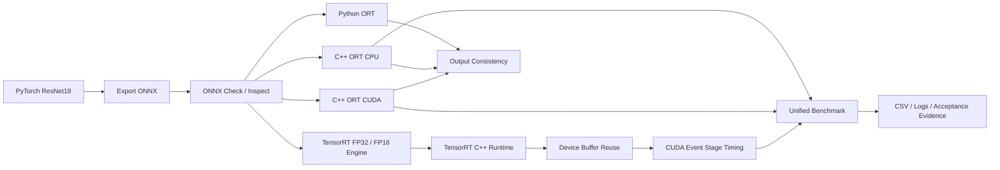

# 基于 ONNX Runtime 与 TensorRT 的视觉模型端侧推理部署与性能优化

> 一个面向端侧 AI / 边缘 AI / 视觉模型部署岗位的推理部署工程项目。项目覆盖 PyTorch → ONNX → ONNX Runtime → TensorRT 的完整部署链路，并对不同后端的延迟、吞吐量和分阶段耗时进行 benchmark 对比。

## 项目概述

本项目以 `ResNet18` 图像分类模型为示例，完成从 PyTorch 模型导出、ONNX 正确性验证、Python/C++ 推理、TensorRT engine 构建，到多后端统一 benchmark 和运行时性能优化的完整部署流程。

项目定位不是模型训练，而是视觉模型推理部署工程，当前已完成：

* PyTorch → ONNX 动态 batch 模型导出；
* PyTorch 与 ONNX Runtime 输出一致性验证；
* ONNX Runtime Python 推理与 benchmark；
* ONNX Runtime C++ CPU / CUDA 双 Provider 推理；
* Python ORT 与 C++ ORT 输出一致性验证；
* ORT CPU / ORT CUDA 动态 batch 一致性验证；
* TensorRT FP32 / FP16 engine 构建；
* TensorRT C++ Runtime 单图与批量推理；
* ORT CPU、ORT CUDA、TensorRT FP32、TensorRT FP16 四后端统一 benchmark；
* TensorRT device buffer 容量复用；
* 基于 CUDA Event 的 H2D、GPU inference、D2H 分阶段计时；
* Buffer 复用前后性能对比；
* Clean build、12 组后端回归测试及异常复测。

项目重点覆盖以下部署能力：

* 模型格式转换与动态 shape；
* Python/C++ 预处理一致性；
* 多后端推理接口；
* CUDA 显存生命周期管理；
* TensorRT 动态 batch；
* 平均延迟、P95 延迟、吞吐量及分阶段耗时评估；
* 性能优化前后对照实验；
* 日志、CSV 和复现实验脚本管理；
* 对性能波动和结论边界进行工程化分析。

## 技术栈

| 类别 | 技术 |
|---|---|
| 模型框架 | PyTorch / torchvision |
| 中间表示 | ONNX |
| 推理后端 | ONNX Runtime CPU / CUDA、TensorRT FP32 / FP16 |
| C++ 图像处理 | OpenCV |
| GPU 加速 | CUDA / TensorRT |
| 工程构建 | CMake / C++17 |
| GPU 计时 | CUDA Event |
| 性能评估 | Avg latency / P95 latency / FPS / warmup / repeat |
| 结果证据 | CSV / JSON / logs / benchmark scripts |

## 项目亮点

* 支持 PyTorch → ONNX 导出，并配置动态 batch 输入。
* 完成 PyTorch、Python ORT、C++ ORT 多实现输出一致性验证。
* 支持 ONNX Runtime C++ 的 CPUExecutionProvider 与 CUDAExecutionProvider 切换。
* 完成 ORT CPU / CUDA 在 batch 1、8、32 下的动态 batch 一致性验证。
* 使用 `trtexec` 构建动态 profile 的 TensorRT FP32 / FP16 engine。
* 实现 TensorRT C++ Runtime 推理、批量推理和统一 benchmark。
* 统一测试 ORT CPU、ORT CUDA、TensorRT FP32、TensorRT FP16 四个后端。
* 统计平均延迟、P95 延迟、最小/最大延迟、FPS 及预处理、推理、后处理耗时。
* 使用 CUDA Event 拆分 H2D、GPU inference、D2H，并验证 GPU total 与三个阶段耗时之和基本一致。
* 将 TensorRT device buffer 从每次推理申请释放，改为按容量扩容并跨推理复用。
* Buffer 复用使 TensorRT 运行阶段墙钟时间降低约 9.65%～27.58%，端到端延迟降低约 1.12%～11.05%。
* 完成删除旧构建目录后的 clean build 和四后端 12 组回归测试。
* 对 TensorRT FP32 batch=32 性能波动进行 5 次复测及 GPU 频率、温度、功耗遥测，保留真实异常证据和解释边界。

## 项目结构

```text
edge_ai_deploy_project/
├── README.md
├── requirements.txt
├── config/
│   └── config.yaml
├── scripts/
│   ├── export_model.py
│   ├── check_onnx.py
│   ├── inspect_onnx.py
│   ├── verify_python_onnx.py
│   ├── verify_python_cpp_ort.py
│   ├── benchmark_test.py
│   ├── plot_benchmark.py
│   ├── run_four_backend_benchmark.sh
│   ├── run_trt_stage_timing_benchmark.sh
│   ├── compare_trt_buffer_reuse.py
│   └── run_resnet18_stage_acceptance.sh
├── cpp/
│   ├── CMakeLists.txt
│   ├── include/
│   │   ├── ort_runner.h
│   │   ├── trt_runner.h
│   │   ├── image_process.h
│   │   ├── benchmark.h
│   │   ├── batch_infer.h
│   │   └── ...
│   └── src/
│       ├── main.cpp
│       ├── benchmark_main.cpp
│       ├── verify_cpp_ort.cpp
│       ├── verify_ort_cpu_cuda_batch.cpp
│       ├── trt_infer_main.cpp
│       ├── trt_benchmark_main.cpp
│       ├── verify_trt_buffer_reuse.cpp
│       ├── ort_runner.cpp
│       ├── trt_runner.cpp
│       ├── benchmark.cpp
│       └── ...
├── labels/
│   └── imagenet_classes.txt
├── models/
│   ├── README.md
│   └── .gitkeep
├── data/
│   ├── README.md
│   └── .gitkeep
├── tensorrt/
│   └── logs/
└── results/
    ├── benchmark/
    │   ├── four_backend_baseline/
    │   ├── trt_stage_timing/
    │   └── trt_buffer_reuse_comparison/
    ├── verify/
    │   ├── verify_pytorch_onnx.json
    │   ├── verify_python_cpp_ort.json
    │   ├── ort_cpu/
    │   ├── ort_cuda/
    │   ├── ort_cpu_cuda_consistency.txt
    │   ├── ort_cpu_cuda_batch_consistency.csv
    │   ├── ort_cpu_cuda_batch_consistency.txt
    │   └── resnet18_stage_acceptance/
    └── plots/
```

## 部署链路



## 环境依赖

### Python 环境

建议使用 conda：

```bash
conda create -n edge_ai python=3.10
conda activate edge_ai
pip install -r requirements.txt
```

主要 Python 依赖包括：

- torch
- torchvision
- onnx
- onnxruntime
- opencv-python
- numpy
- pandas
- matplotlib
- PyYAML

### C++ 环境

C++ 部分依赖：

- CMake >= 3.22
- C++17
- OpenCV
- ONNX Runtime C++ Runtime
- CUDA Toolkit
- TensorRT

> 注意：需要根据本机环境修改 `cpp/CMakeLists.txt` 中 ONNX Runtime、TensorRT、CUDA 的实际路径。

## 数据与模型准备

本仓库默认不提交大规模图片、ONNX 模型和 TensorRT engine 文件。

测试图片建议放置为：

```text
data/
└── images/
    ├── image1.jpg
    ├── image2.jpg
    └── ...
```

模型文件建议放置为：

```text
models/
├── model.onnx
├── model_fp32.engine
└── model_fp16.engine
```

TensorRT engine 与 GPU、CUDA、TensorRT 版本强相关，建议在目标机器上重新构建，不建议直接复用其他环境生成的 engine 文件。

> 注意：当前部分 benchmark 与阶段验收脚本仍保留作者本机路径配置。运行前需要检查脚本顶部的 `PROJECT_ROOT`、`MODEL`、`IMAGE_DIR`、`FP32_ENGINE` 和 `FP16_ENGINE` 变量。上述 `models/` 与 `data/` 是推荐目录结构，不代表现有脚本已经全部切换为仓库相对路径。

## 1. PyTorch 导出 ONNX

运行：

```bash
python scripts/export_model.py
```

导出逻辑：

- 使用 `torchvision.models.resnet18(weights=ResNet18_Weights.DEFAULT)`；
- 输入 shape 为 `[batch, 3, 224, 224]`；
- 支持动态 batch；
- 输出 ONNX 模型。

检查 ONNX：

```bash
python scripts/check_onnx.py
python scripts/inspect_onnx.py
```

## 2. PyTorch / ONNX Runtime 一致性验证

运行：

```bash
python scripts/verify_python_onnx.py \
  --onnx models/model.onnx \
  --image data/images/test.jpg \
  --output results/verify/verify_pytorch_onnx.json \
  --device cpu \
  --provider CPUExecutionProvider
```

验证内容：

- PyTorch 输出；
- ONNX Runtime 输出；
- max absolute error；
- mean absolute error；
- Top1 是否一致；
- Top5 是否一致。

结果示例：

```text
results/verify/verify_pytorch_onnx.json
```

## 3. ONNX Runtime Python 推理与 benchmark

CPU benchmark：

```bash
python scripts/benchmark_test.py \
  --input data/images \
  --output results/python_benchmark_cpu \
  --models models \
  --config config \
  --batch_size 1 8 16 32 \
  --warmup 5 \
  --repeat 50 \
  --provider CPUExecutionProvider
```

如果当前环境支持 `CUDAExecutionProvider`，也可以运行 GPU benchmark：

```bash
python scripts/benchmark_test.py \
  --input data/images \
  --output results/python_benchmark_gpu \
  --models models \
  --config config \
  --batch_size 1 8 16 32 \
  --warmup 5 \
  --repeat 50 \
  --provider CUDAExecutionProvider
```

## 4. 编译 C++ 工程

建议从仓库根目录执行 clean build：

```bash
rm -rf cpp/build

cmake -S cpp -B cpp/build
cmake --build cpp/build -j"$(nproc)"
```

编译成功后生成：

```text
cpp/build/cpp_ort_infer
cpp/build/cpp_ort_benchmark
cpp/build/verify_cpp_ort
cpp/build/verify_ort_cpu_cuda_batch
cpp/build/cpp_trt_infer
cpp/build/cpp_trt_benchmark
cpp/build/verify_trt_buffer_reuse
```

> `cpp/CMakeLists.txt` 中的 ONNX Runtime 路径基于作者本机环境配置。若本机安装路径不同，需要修改 `ORT_DIR`，并确认 OpenCV、CUDA 与 TensorRT 能被 CMake 正确发现。

## 5. ONNX Runtime C++ 推理

进入构建目录：

```bash
cd cpp/build
```

### CPU 推理

```bash
./cpp_ort_infer \
  ../../models/model.onnx \
  ../../data/images \
  ../../labels/imagenet_classes.txt \
  8 \
  --provider cpu
```

### CUDA 推理

```bash
./cpp_ort_infer \
  ../../models/model.onnx \
  ../../data/images \
  ../../labels/imagenet_classes.txt \
  8 \
  --provider cuda
```

参数说明：

| 参数 | 含义 |
|---|---|
| `../../models/model.onnx` | ONNX 模型路径 |
| `../../data/images` | 输入图片目录 |
| `../../labels/imagenet_classes.txt` | ImageNet 标签文件 |
| `8` | batch size |
| `--provider cpu` | 使用 CPUExecutionProvider |
| `--provider cuda` | 使用 CUDAExecutionProvider |
| 不指定 `--provider` | 默认使用 CPU |

## 6. ONNX Runtime C++ benchmark

以下命令为单后端独立运行示例。README 中正式展示的四后端结果统一采用 batch 1、8、32，warmup=3，repeat=10。

### ORT CPU benchmark

```bash
cd cpp/build

./cpp_ort_benchmark \
  ../../models/model.onnx \
  ../../data/images \
  ../../labels/imagenet_classes.txt \
  32 \
  3 \
  10 \
  ../../results/benchmark/ort_cpu_benchmark.csv \
  --provider cpu
```

### ORT CUDA benchmark

```bash
./cpp_ort_benchmark \
  ../../models/model.onnx \
  ../../data/images \
  ../../labels/imagenet_classes.txt \
  32 \
  3 \
  10 \
  ../../results/benchmark/ort_cuda_benchmark.csv \
  --provider cuda
```

统计字段包括：

- average latency；
- P95 latency；
- min / max latency；
- FPS；
- average preprocess time；
- average inference time；
- average postprocess time。

## 7. TensorRT engine 构建

### FP32 engine

```bash
trtexec \
  --onnx=models/model.onnx \
  --saveEngine=models/model_fp32.engine \
  --minShapes=input:1x3x224x224 \
  --optShapes=input:8x3x224x224 \
  --maxShapes=input:32x3x224x224
```

### FP16 engine

```bash
trtexec \
  --onnx=models/model.onnx \
  --saveEngine=models/model_fp16.engine \
  --fp16 \
  --minShapes=input:1x3x224x224 \
  --optShapes=input:8x3x224x224 \
  --maxShapes=input:32x3x224x224
```

参数说明：

| 参数 | 含义 |
|---|---|
| `--onnx` | 输入 ONNX 模型 |
| `--saveEngine` | 输出 TensorRT engine |
| `--fp16` | 启用 FP16 精度 |
| `--minShapes` | 动态输入最小 shape |
| `--optShapes` | TensorRT 优化时重点优化的 shape |
| `--maxShapes` | 动态输入最大 shape |

本项目保留了 TensorRT 构建日志：

```text
tensorrt/logs/build_fp32.log
tensorrt/logs/build_fp16.log
```

## 8. TensorRT C++ 推理

FP16：

```bash
cd cpp/build

./cpp_trt_infer \
  ../../models/model_fp16.engine \
  ../../data/images \
  ../../labels/imagenet_classes.txt \
  8
```

FP32：

```bash
./cpp_trt_infer \
  ../../models/model_fp32.engine \
  ../../data/images \
  ../../labels/imagenet_classes.txt \
  8
```

TensorRT C++ Runtime 推理流程：

```text
加载 TensorRT engine
↓
创建 runtime / engine / execution context
↓
OpenCV 图像预处理
↓
Host 输入拷贝到 Device
↓
TensorRT enqueue 推理
↓
Device 输出拷贝回 Host
↓
TopK 后处理
```

## 9. TensorRT C++ benchmark

以下命令为单后端独立运行示例。最后一个 `stage_timing_csv` 参数为可选参数，用于保存 TensorRT 专属的 H2D、GPU inference 和 D2H 阶段计时。

### FP16

```bash
cd cpp/build

./cpp_trt_benchmark \
  ../../models/model_fp16.engine \
  ../../data/images \
  ../../labels/imagenet_classes.txt \
  32 \
  3 \
  10 \
  TensorRT_FP16 \
  ../../results/benchmark/trt_fp16_common.csv \
  ../../results/benchmark/trt_fp16_stage_timing.csv
```

### FP32

```bash
./cpp_trt_benchmark \
  ../../models/model_fp32.engine \
  ../../data/images \
  ../../labels/imagenet_classes.txt \
  32 \
  3 \
  10 \
  TensorRT_FP32 \
  ../../results/benchmark/trt_fp32_common.csv \
  ../../results/benchmark/trt_fp32_stage_timing.csv
```

其中：

- 第一个 CSV 保存与 ORT 统一的公共 benchmark 字段；
- 第二个 CSV 保存 TensorRT 专属的 GPU 分阶段计时字段；
- 不需要阶段计时时，可以省略最后一个参数。

## 10. 四后端统一 Benchmark

运行前先检查脚本顶部的模型、图片和 engine 路径，然后执行：

```bash
bash scripts/run_four_backend_benchmark.sh
```

统一测试以下四个推理后端：

```text
ORT CPU
ORT CUDA
TensorRT FP32
TensorRT FP16
```

### Benchmark 设置

| 项目 | 设置 |
|---|---|
| 模型 | ResNet18 |
| 输入尺寸 | `N × 3 × 224 × 224` |
| 测试图片数量 | 244 张 |
| Batch size | 1 / 8 / 32 |
| Warmup | 3 |
| Repeat | 10 |
| 端到端阶段 | preprocess + inference + postprocess |
| 统计指标 | Avg / P95 / min / max latency、FPS |
| 对比后端 | ORT CPU / ORT CUDA / TensorRT FP32 / TensorRT FP16 |

所有后端使用相同的：

- ONNX 模型；
- 输入图片集；
- ImageNet 标签；
- batch size；
- warmup 和 repeat；
- 预处理与后处理逻辑；
- CSV 字段定义。

### Clean build 后四后端回归结果

| Backend | Batch | Avg latency (ms/batch) | P95 (ms) | FPS | Avg preprocess (ms) | Avg infer/run (ms) |
|---|---:|---:|---:|---:|---:|---:|
| ORT CPU | 1 | 34.880 | 36.831 | 28.67 | 2.534 | 32.308 |
| ORT CPU | 8 | 275.910 | 297.335 | 28.53 | 19.512 | 256.160 |
| ORT CPU | 32 | 1021.071 | 1102.062 | 29.87 | 73.424 | 946.788 |
| ORT CUDA | 1 | 3.999 | 4.598 | 250.08 | 2.395 | 1.572 |
| ORT CUDA | 8 | 28.264 | 35.705 | 278.48 | 19.273 | 8.745 |
| ORT CUDA | 32 | 99.390 | 117.214 | 306.87 | 71.141 | 27.387 |
| TensorRT FP32 | 1 | 5.067 | 5.622 | 197.37 | 2.562 | 2.469 |
| TensorRT FP32 | 8 | 26.601 | 35.515 | 295.89 | 19.964 | 6.388 |
| TensorRT FP32 | 32 | 99.412 | 131.672 | 306.80 | 77.295 | 21.227 |
| TensorRT FP16 | 1 | 4.150 | 5.079 | 240.99 | 2.574 | 1.542 |
| TensorRT FP16 | 8 | 24.868 | 31.570 | 316.50 | 19.944 | 4.679 |
| TensorRT FP16 | 32 | 89.562 | 112.281 | 340.55 | 76.517 | 12.156 |

完整结果：

```text
results/verify/resnet18_stage_acceptance/four_backend_recheck.csv
```

### 主要性能结论

在 batch=32 条件下：

```text
ORT CPU FPS       = 29.87 images/s
ORT CUDA FPS      = 306.87 images/s
TensorRT FP32 FPS = 306.80 images/s
TensorRT FP16 FPS = 340.55 images/s
```

TensorRT FP16 相较 ORT CPU：

```text
吞吐量提升约 11.40 倍
端到端平均延迟降低约 91.23%
推理运行阶段耗时降低约 77.88 倍
```

其中，TensorRT 的 `Avg infer/run` 表示一次 `TrtRunner::run()` 的 CPU 墙钟时间，包含：

```text
H2D
TensorRT enqueue 和 GPU 执行
D2H
同步及少量 Host 端管理开销
```

它不等同于纯 GPU kernel 执行时间。

### 性能瓶颈迁移

ORT CPU、batch=32：

| Stage | Time (ms/batch) | 比例 |
|---|---:|---:|
| Preprocess | 73.424 | 7.19% |
| Inference | 946.788 | 92.73% |
| Postprocess | 0.859 | 0.08% |

TensorRT FP16、batch=32：

| Stage | Time (ms/batch) | 比例 |
|---|---:|---:|
| Preprocess | 76.517 | 85.43% |
| TensorRT run | 12.156 | 13.57% |
| Postprocess | 0.889 | 0.99% |

结果表明：

- ORT CPU 的主要瓶颈是模型计算；
- 使用 GPU 后，推理阶段耗时大幅下降；
- TensorRT FP16 下，端到端瓶颈转移到 CPU 图像读取和预处理；
- 后续端到端优化应重点关注多线程预处理、Pinned Memory、异步拷贝和流水线重叠。

## 11. TensorRT GPU 分阶段计时

TensorRT 运行阶段使用 CUDA Event 拆分为：

```text
H2D
→ GPU inference
→ D2H
```

运行前检查脚本路径配置，然后执行：

```bash
bash scripts/run_trt_stage_timing_benchmark.sh
```

统计字段包括：

```text
avg_trt_run_wall_ms
avg_h2d_ms
avg_gpu_inference_ms
avg_d2h_ms
avg_gpu_total_ms
avg_gpu_stage_sum_ms
wall_minus_gpu_total_ms
```

验证关系：

```text
avg_gpu_total_ms
≈ avg_h2d_ms
+ avg_gpu_inference_ms
+ avg_d2h_ms
```

完整结果：

```text
results/benchmark/trt_stage_timing/
```

需要注意：

- CUDA Event 用于测量 GPU stream 时间；
- `std::chrono` 用于测量 CPU 墙钟时间；
- 两种计时器属于不同计时域；
- `wall_minus_gpu_total_ms` 只能作为 Host 端额外开销的近似观察值；
- 不能将其严格解释为某一个 API 的独立耗时。

## 12. TensorRT Device Buffer 复用

### 优化前

每次调用 `TrtRunner::run()` 均执行：

```text
cudaMalloc input
cudaMalloc output
H2D
TensorRT inference
D2H
cudaFree input
cudaFree output
```

### 优化后

将 device buffer 改为 `TrtRunner` 成员：

```text
检查所需容量
仅在容量不足时申请或扩容
后续推理复用现有 buffer
TrtRunner 析构时统一释放
```

支持动态 batch 切换：

```text
32 → 1 → 8 → 32
```

在容量足够时不会重复申请显存。

### 复用前后对比

| Precision | Batch | TensorRT run 降低 | 端到端延迟降低 | FPS 提升 |
|---|---:|---:|---:|---:|
| FP32 | 1 | 14.95% | 6.64% | 7.11% |
| FP32 | 8 | 9.65% | 2.67% | 2.75% |
| FP32 | 32 | 14.17% | 1.27% | 1.28% |
| FP16 | 1 | 27.58% | 11.05% | 12.43% |
| FP16 | 8 | 13.04% | 1.12% | 1.14% |
| FP16 | 32 | 13.89% | 3.09% | 3.19% |

整体结果：

```text
TensorRT run 墙钟时间降低：9.65%～27.58%
端到端延迟降低：1.12%～11.05%
吞吐量提升：1.14%～12.43%
```

完整对比证据：

```text
results/benchmark/trt_buffer_reuse_comparison/
```

准确结论是：

> Device buffer 复用稳定降低了 TensorRT 完整运行阶段的墙钟时间，主要收益来自避免每次推理重复申请和释放显存及其相关 Host 端管理开销。该实验不能证明 GPU 模型计算本身因 buffer 复用而获得稳定加速。

## 13. Clean Build 与阶段验收

阶段验收分为两个步骤：先完成 clean build，再使用新生成的二进制运行四后端回归测试。

### 13.1 Clean build

从仓库根目录执行：

```bash
set -o pipefail

mkdir -p results/verify/resnet18_stage_acceptance
rm -rf cpp/build

cmake -S cpp -B cpp/build \
  2>&1 | tee results/verify/resnet18_stage_acceptance/cmake_configure.log

cmake --build cpp/build -j"$(nproc)" \
  2>&1 | tee results/verify/resnet18_stage_acceptance/clean_build.log
```

### 13.2 四后端阶段验收

先检查 `scripts/run_resnet18_stage_acceptance.sh` 顶部的模型、图片与 engine 路径，然后执行：

```bash
bash scripts/run_resnet18_stage_acceptance.sh
```

该脚本负责：

- 检查 ORT 与 TensorRT benchmark 可执行文件；
- 检查 ONNX 模型、图片目录、ImageNet 标签和 FP32 / FP16 engine；
- 运行 ORT CPU、ORT CUDA、TensorRT FP32、TensorRT FP16；
- 完成 batch 1、8、32 共 12 组回归测试；
- 保存运行日志和统一 CSV。

该脚本本身不负责删除 `cpp/build`、执行 CMake 配置或重新编译，这些工作由前面的 clean build 命令完成。

验收结果：

| 项目 | 结论 |
|---|---|
| Clean build | 通过 |
| ORT CPU | 通过 |
| ORT CUDA | 通过 |
| TensorRT FP32 | 功能通过；batch=32 存在已记录的运行时性能波动 |
| TensorRT FP16 | 通过 |
| 动态 batch | 通过 |
| Device buffer 复用 | 通过 |
| CUDA Event 分阶段计时 | 通过 |
| CSV 和日志证据 | 通过 |

TensorRT FP32、batch=32 回归中观察到运行时性能波动。进一步复测和 GPU 遥测显示：

```text
GPU 温度：42～45℃
GPU 功耗：约 20～50 W，未接近 170 W 上限
其他 CUDA 计算进程：未发现
前半段 SM 频率：1807 MHz
后半段 SM 频率：607～1042 MHz
性能状态：由 P2 切换为 P3/P5
```

遥测结果显示，运行后半段 GPU 性能状态由 P2 切换至 P3/P5，SM 频率明显下降；同时未发现高温、功耗触顶或其他 CUDA 计算进程。现有证据更支持运行环境与 GPU 动态频率波动的解释，尚无充分证据将该性能变化归因于本次代码修改。

完整验收证据：

```text
results/verify/resnet18_stage_acceptance/
```

## 结果文件

仓库保留了模型正确性验证、性能测试、优化对照和阶段验收证据。

### 正确性验证

| 内容 | 路径 |
|---|---|
| PyTorch / ONNX Runtime 一致性验证 | [`results/verify/verify_pytorch_onnx.json`](results/verify/verify_pytorch_onnx.json) |
| Python ORT / C++ ORT 一致性验证 | [`results/verify/verify_python_cpp_ort.json`](results/verify/verify_python_cpp_ort.json) |
| ORT CPU / CUDA 一致性验证 | [`results/verify/ort_cpu_cuda_consistency.txt`](results/verify/ort_cpu_cuda_consistency.txt) |
| ORT CPU / CUDA 动态 batch 一致性验证 | [`results/verify/ort_cpu_cuda_batch_consistency.txt`](results/verify/ort_cpu_cuda_batch_consistency.txt) |
| ORT 动态 batch 结构化结果 | [`results/verify/ort_cpu_cuda_batch_consistency.csv`](results/verify/ort_cpu_cuda_batch_consistency.csv) |
| ORT CPU 原始输出 | [`results/verify/ort_cpu/`](results/verify/ort_cpu/) |
| ORT CUDA 原始输出 | [`results/verify/ort_cuda/`](results/verify/ort_cuda/) |

### 性能测试

| 内容 | 路径 |
|---|---|
| 四后端统一 benchmark | [`results/benchmark/four_backend_baseline/`](results/benchmark/four_backend_baseline/) |
| TensorRT GPU 阶段计时 | [`results/benchmark/trt_stage_timing/`](results/benchmark/trt_stage_timing/) |
| Buffer 复用前后对比 | [`results/benchmark/trt_buffer_reuse_comparison/`](results/benchmark/trt_buffer_reuse_comparison/) |
| Clean-build 四后端回归结果 | [`results/verify/resnet18_stage_acceptance/four_backend_recheck.csv`](results/verify/resnet18_stage_acceptance/four_backend_recheck.csv) |

### 阶段验收与异常复核

| 内容 | 路径 |
|---|---|
| ResNet18 阶段验收说明 | [`results/verify/resnet18_stage_acceptance/README.md`](results/verify/resnet18_stage_acceptance/README.md) |
| Clean-build 配置与编译日志 | [`results/verify/resnet18_stage_acceptance/`](results/verify/resnet18_stage_acceptance/) |
| FP32 batch=32 五次复测 | [`results/verify/resnet18_stage_acceptance/fp32_batch32_recheck/`](results/verify/resnet18_stage_acceptance/fp32_batch32_recheck/) |
| GPU 状态遥测 | [`results/verify/resnet18_stage_acceptance/fp32_batch32_telemetry/`](results/verify/resnet18_stage_acceptance/fp32_batch32_telemetry/) |

### TensorRT 构建证据

```text
tensorrt/logs/build_fp32.log
tensorrt/logs/build_fp16.log
```

TensorRT engine 文件未提交到仓库。Engine 与 GPU 型号、CUDA 版本和 TensorRT 版本强相关，应在目标机器上重新构建。

## 常见问题

### 1. 找不到 ONNX Runtime 动态库

现象：

```text
error while loading shared libraries: libonnxruntime.so
```

解决：

```bash
export LD_LIBRARY_PATH=/path/to/onnxruntime/lib:$LD_LIBRARY_PATH
```

也可以在 `CMakeLists.txt` 中设置 RPATH。

### 2. TensorRT engine 反序列化失败

现象：

```text
Failed to deserialize TensorRT engine
```

可能原因：

- engine 文件路径错误；
- engine 文件为空；
- TensorRT 版本不匹配；
- engine 不是在当前 GPU / CUDA / TensorRT 环境下构建的。

建议在当前机器重新使用 `trtexec` 构建 engine。

### 3. batch size 超过 engine 支持范围

如果 engine 构建时设置：

```bash
--maxShapes=input:32x3x224x224
```

则运行时 batch size 不能超过 32。若运行 batch=64，可能出现动态 shape 设置失败。

解决：

- 将 batch size 改为 1、8、16、32；
- 或重新构建支持更大 maxShapes 的 TensorRT engine。

### 4. Python / C++ / TensorRT 输出不一致

需要检查预处理是否完全一致：

```text
OpenCV imread
↓
resize 224×224
↓
BGR → RGB
↓
/255.0
↓
mean/std normalize
↓
HWC → CHW
↓
NCHW batch tensor
```

如果 BGR/RGB、mean/std、HWC/CHW 或 batch shape 任一步不一致，TopK 结果都可能发生偏差。

## 后续优化方向

ResNet18 分类部署链路已完成阶段验收，后续不再继续堆叠同类功能，主要沿以下方向推进：

* 将 CPU 图像预处理改为多线程或异步数据加载；
* 使用 Pinned Memory 和异步 H2D 拷贝，减少数据传输等待；
* 尝试使用多个 CUDA stream，重叠预处理、数据传输和 GPU 推理；
* 评估 GPU 预处理方案，减少 CPU 预处理瓶颈；
* 增加统一 backend 配置或命令行参数，简化 ORT CPU、ORT CUDA 和 TensorRT 之间的切换；
* 增加显存占用、GPU 利用率和运行环境信息记录；
* 输出更完整的 JSON benchmark 报告；
* 迁移到 YOLO 目标检测模型，完成检测模型 ONNX 导出、TensorRT 部署、后处理和性能对比。

## 项目总结

本项目完成了 ResNet18 视觉分类模型从 PyTorch 导出、ONNX 正确性验证、ONNX Runtime Python/C++ 推理，到 TensorRT FP32/FP16 C++ 部署的完整工程闭环，并建立了 ORT CPU、ORT CUDA、TensorRT FP32 和 TensorRT FP16 四后端统一 benchmark。

在本机 244 张图片、batch=32、warmup=3、repeat=10 的 clean-build 回归测试中，TensorRT FP16 吞吐量达到 340.55 images/s，ORT CPU 吞吐量为 29.87 images/s，前者约为后者的 11.40 倍；端到端平均延迟由 1021.07 ms/batch 降低至 89.56 ms/batch。性能分阶段结果表明，GPU 推理优化后，端到端瓶颈已由模型计算转移至 CPU 图像读取与预处理。

项目进一步完成了 TensorRT device buffer 容量复用，并通过复用前后统一对照实验验证：TensorRT 运行阶段墙钟时间降低 9.65%～27.58%，端到端延迟降低 1.12%～11.05%，吞吐量提升 1.14%～12.43%。同时使用 CUDA Event 拆分 H2D、GPU inference 和 D2H，保留了完整的 CSV、日志、独立复测和 GPU 遥测证据。

最终，clean build、四后端 12 组回归测试、动态 batch、输出一致性、device buffer 复用和 GPU 阶段计时均完成验收。TensorRT FP32 batch=32 测试中观察到与 GPU 动态频率相关的性能波动，但未发现能够归因于代码的稳定功能错误或性能回退。
